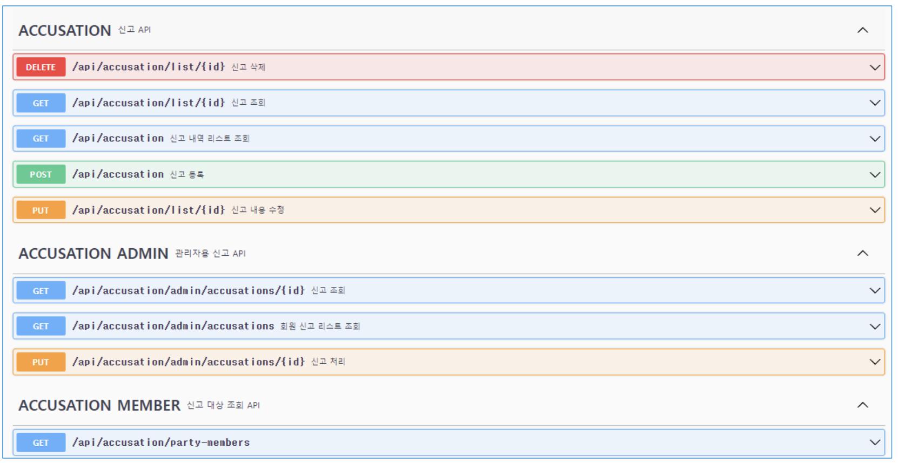
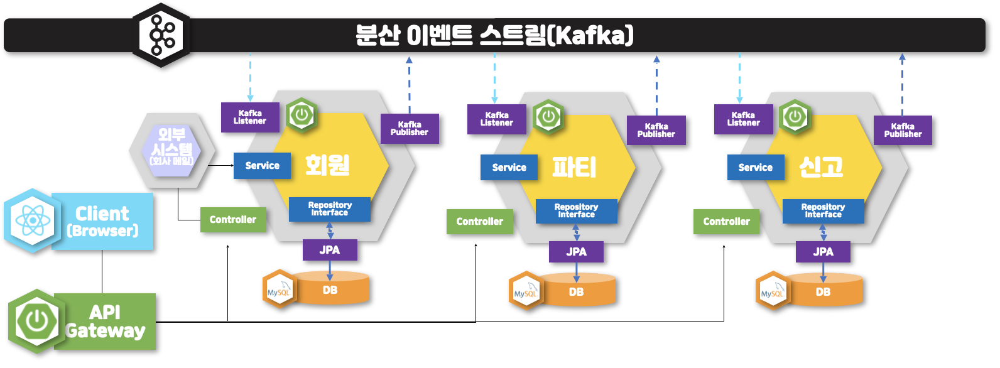
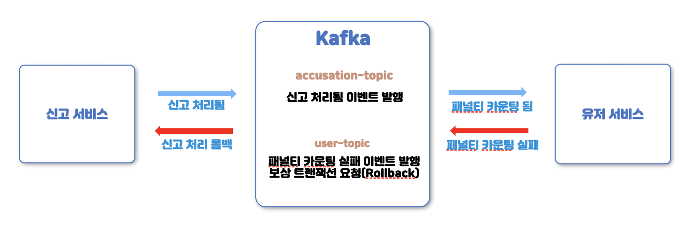
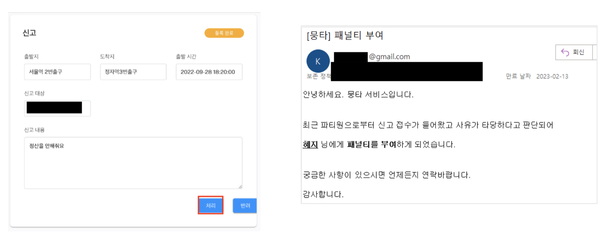
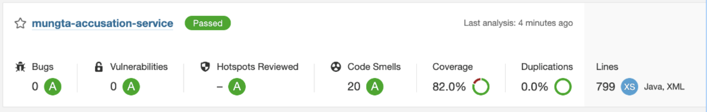
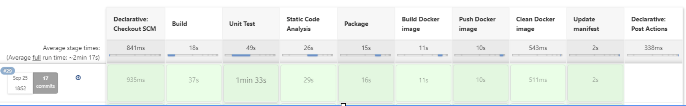
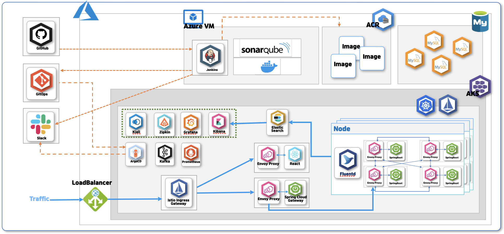
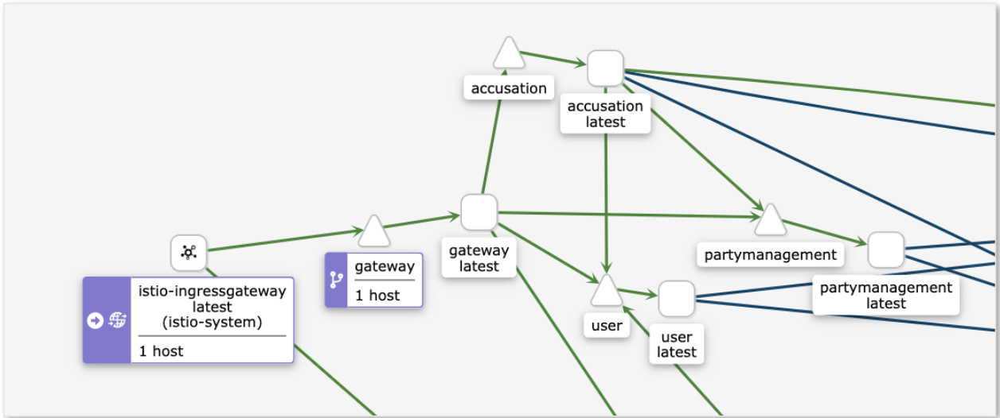
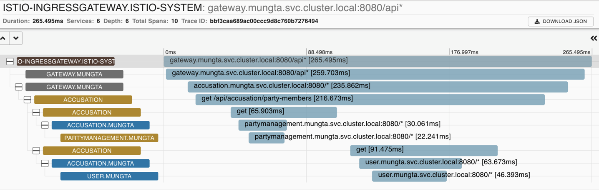

## Mungta Accusation Service (신고관리 서비스)

### Domain Modeling

### Swagger

- http://localhost:8089/api/accusation/swagger-ui.html

### Event 통신

### SAGA 패턴

- 패널티 카운팅 실패시 "PenaltyFailed" Event를 받아 신고 처리한 상태를 롤백.

### 신고 처리시 Email 전송

- 유저 서비스에서 패널티 카운팅 성공했다고 보낸 "PenaltySucceed" Event를 받으면 비동기로 Email 전송.
- Email Format은 Thymeleaf 사용.

### 정적 분석

### Jenkins

### Infra

### Kiali

### Zipkin

